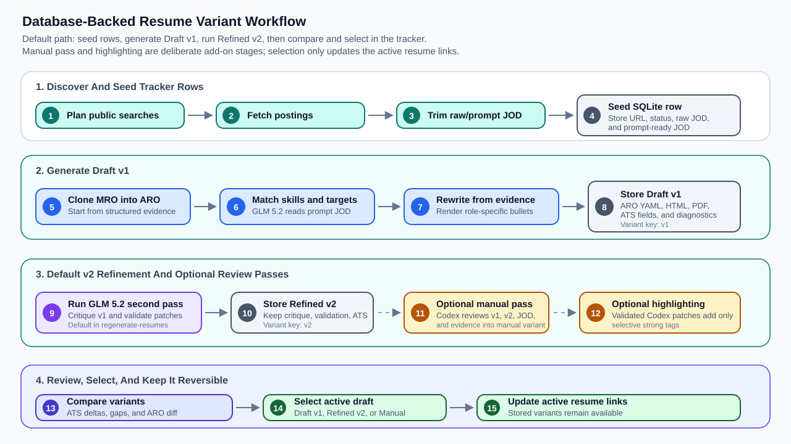
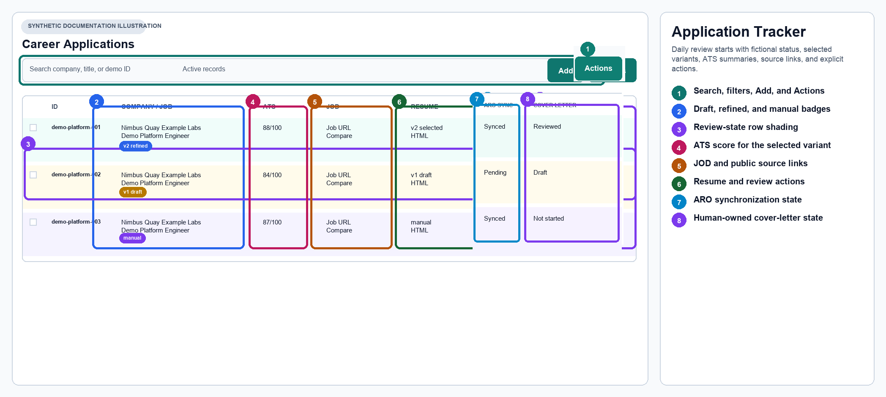
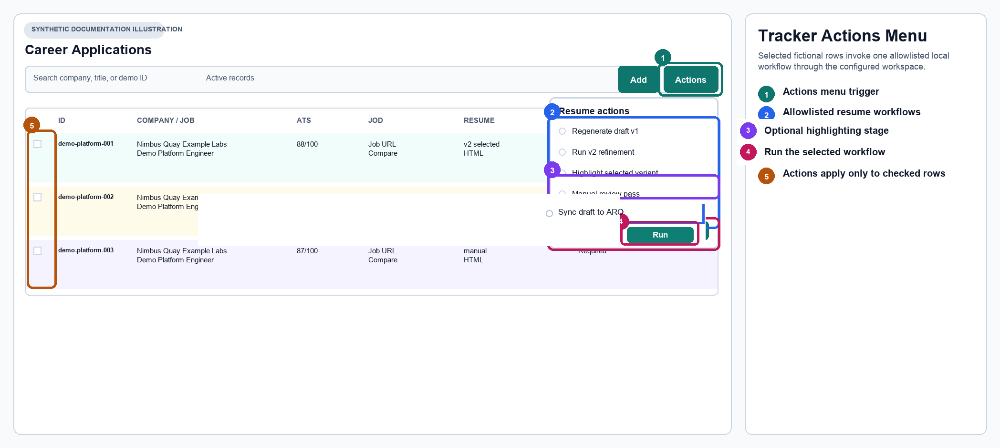
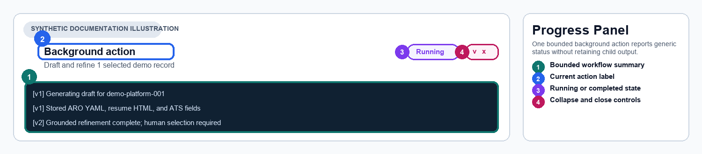
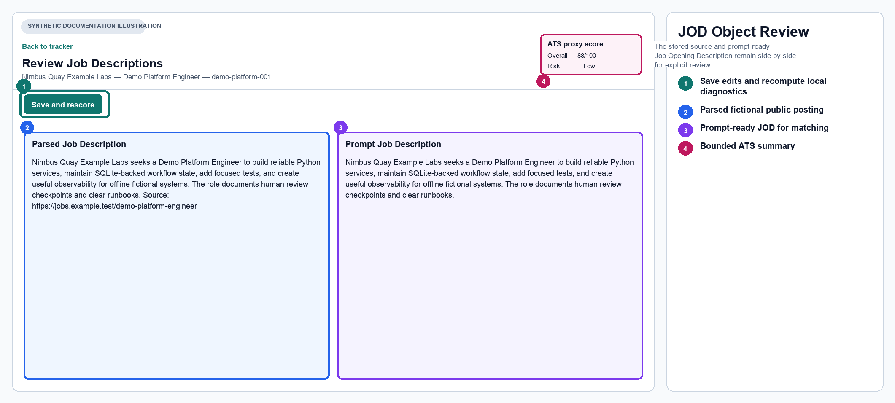
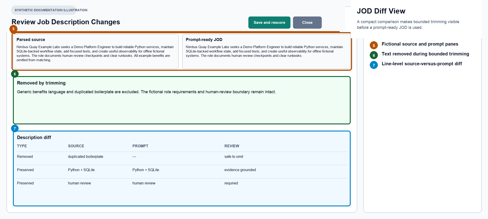
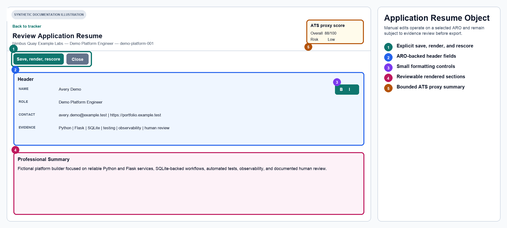
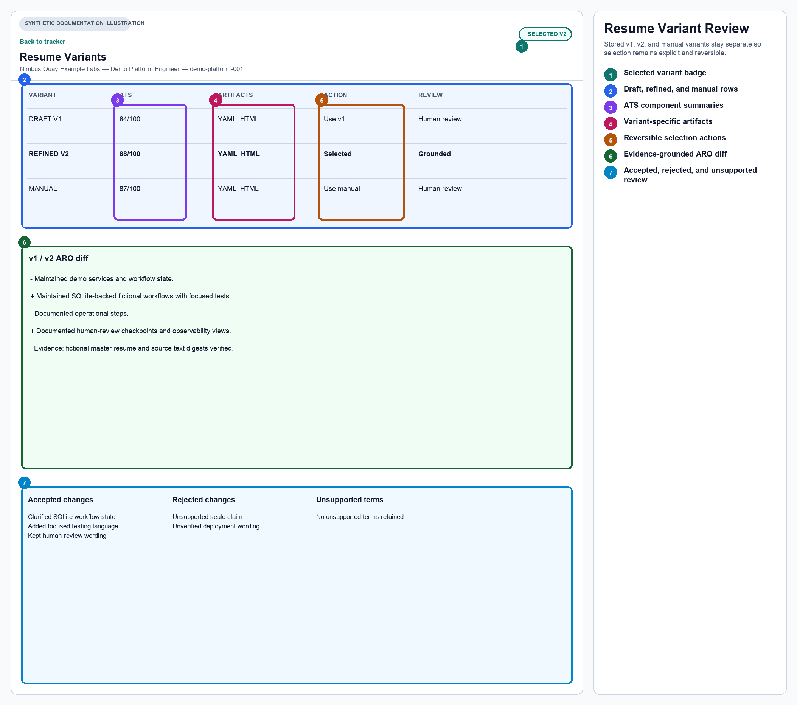
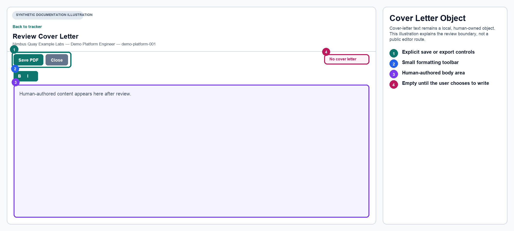

# Career Agent Workbench

Career Agent Workbench is a local, human-governed portfolio application for
researching public job postings, maintaining application state, and producing
reviewable resume variants. It combines a provider-neutral Python core,
SQLite-backed workflow state, deterministic rendering and ATS diagnostics, a
Flask tracker, command-line and Make workflows, and a proportional FastMCP
server.

The public repository contains reusable software, synthetic tests, fictional
examples, and documentation. A separate operator-owned workspace contains real
profile evidence, tracker data, generated documents, credentials, and model
configuration. The application does not authenticate to LinkedIn, access
private-member data, submit applications, contact employers, or make a hiring
decision. Any model-produced resume or cover-letter content remains a draft
until a person reviews it.

Version 2.1.0 expands the public documentation around one coherent fictional
case: Tessa Rowan is a platform and reliability engineer considering the Senior
Platform Automation Engineer opening at Rivermark Platform Services. The
tracked posting is intentionally a credible but imperfect match. It overlaps
with Tessa's Python, Ansible, AWX, cloud, OpenSearch, Grafana, Prometheus,
testing, and operational-support evidence while naming preferred gaps such as
Argo CD, Backstage, Crossplane, and OpenTelemetry. All people, organizations,
locations, dates, credentials, and opportunities in that case are fictional,
and every public URL uses a reserved domain.

## Safety posture

The workbench is deliberately conservative about authority and data placement:

- Real resume text, the Master Resume Object, job rows, application artifacts,
  credentials, logs, and model settings belong outside the public checkout.
- Public-job access is limited to guest-accessible pages and bounded generic
  public URLs. Authenticated sessions and private profile data are out of scope.
- Generated changes are evidence-grounded, stored as variants, and marked for
  human review. Creating a variant does not approve or submit it.
- Database writes use the application-state layer, transactional operations,
  revision checks, and explicit selection rules. Filesystem exports are
  restricted to the configured workspace.
- Errors crossing provider, model, process, parser, or filesystem boundaries
  are bounded and content-hidden. Tests use injected responses and synthetic
  temporary workspaces.
- No workflow sends a resume, cover letter, message, or application to a third
  party. The final application decision and every external action remain with
  the operator.

That boundary matters more than feature count: this is a review workbench, not
an autonomous application agent.

## Key terms and stored objects

The repository uses a small vocabulary consistently across Python, SQLite,
Make, the Flask tracker, and the examples.

- **Master resume text** is the concise, human-maintained factual source. It is
  the readable evidence record from which structured resume claims are
  reconciled.
- **MRO — Master Resume Object** is `MASTER-RESUME.yml`, the structured and
  reusable representation of that source. It contains the header, summary,
  skills taxonomy, experience, education, certifications, portfolio, source
  evidence, and cross-links used by later workflows.
- **Job description** is the full stored public posting. The source text is
  retained separately from the prompt-ready form.
- **JOD — Job Opening Description** is the normalized, bounded job context used
  by matching and resume workflows. In an ARO it also contains ordered
  requirement targets.
- **ARO — Application Resume Object** is a job-specific resume mapping derived
  from the MRO. It can be rendered to HTML and PDF and stored as an isolated
  variant.
- **CLO — Cover Letter Object** is a separately stored, human-owned cover-letter
  mapping. It has its own editing and rendering path; it is not implied by an
  ARO.
- **ATS diagnostics** are deterministic local signals for a rendered resume
  and JOD pair: parsing, keyword, semantic, and formatting components plus
  bounded matched and missing terms. They are diagnostics, not a prediction of
  employer behavior.
- **Variant** is one of `v1`, `v2`, or `manual`. Each variant retains its own
  ARO, rendered artifacts, diagnostics, lineage, validation, evidence packet,
  and model metadata where applicable.
- **Selection** identifies which stored variant drives the application-level
  resume projection. Automatic selection prefers `manual`, then `v2`, then
  `v1`; an explicit human selection remains pinned until it is changed or reset.

The distinction between source, object, rendered artifact, and selected state
prevents a generated file from silently becoming the authoritative resume.

## Architecture and workspace boundary

The package is Python-first. Domain modules accept explicit paths, services,
model runners, transports, or stores, while CLI and Make layers compose those
capabilities after parsing. The same application-state contract supports the
command line, archived Flask interface, and MCP matching tool.

```text
public checkout                         external operator workspace
-------------------------------         -------------------------------
src/career_agent_workbench/      --->   profile/MP-MASTER-RESUME.txt
scripts/ and Makefile                   profile/MASTER-RESUME.yml
packaged templates and skills           output/tracking/applications.sqlite3
fictional examples and tests            output/ and downloads/
README and release metadata             tmp/, .blacklist, and private .env
```

The ignored root `.env` is bootstrap-only. It selects the external workspace
and the private dotenv; it should not hold tokens or personal settings:

```dotenv
CAREER_AGENT_WORKBENCH_WORKSPACE=../career-agent-workbench-ops
CAREER_AGENT_WORKBENCH_PRIVATE_ENV_FILE=../career-agent-workbench-ops/.env
```

The private dotenv is required to have user-only mode `0600` on platforms that
support POSIX permissions. Conventional members resolve beneath the workspace,
and individual members may be overridden there. Explicit CLI values have the
highest precedence, followed by process values, the private dotenv, and public
defaults. Configuration loading returns immutable settings and paths without
mutating the process environment. Invalid, escaping, or unsafe paths fail with
sanitized errors.

See [`.env.example`](.env.example) for the complete public configuration
surface. Do not copy real values into documentation, issue reports, fixtures,
or committed test output.

The existing MRO and application-workflow diagrams are tracked explanatory
assets. They remain unchanged during the 2.1.0 text-parity phase and will be
reviewed separately for final visual parity.




## Installation and first setup

Use the repository-root Make targets. The supported public environment is the
ignored `.venv`; a legacy environment is not part of the operator contract.

```bash
make install
make console-scripts
cp .env.example .env
make skill-link
make test
make lint
```

`make install` creates `.venv`, installs the editable `.[dev,browser]` package,
and installs Playwright Chromium. It does not install Ollama, configure an API
key, call a model, search for jobs, or initialize a private workspace.
`make console-scripts` verifies the six packaged executables. `make skill-link`
idempotently links exactly the five repository skills—Career Agent Workbench,
master-resume YAML, manual resume passthrough, workflow initialization, and
workflow control—into the configured Codex skills directory. It refuses to
overwrite a non-symlink.

After copying `.env.example`, edit only the ignored `.env` selectors and the
external private dotenv. A conventional private workspace looks like this:

```text
career-agent-workbench-ops/
├── .env                         # mode 0600; credentials and runtime settings
├── .blacklist
├── profile/
│   ├── MP-MASTER-RESUME.txt
│   └── MASTER-RESUME.yml
├── output/
│   └── tracking/
│       └── applications.sqlite3
├── tmp/
└── downloads/
```

The application creates or updates operational state only when a selected
command needs it. Help and version commands load no workspace. Use
`career-agent-workbench --help` and the specific executable's `--help` before
running a stateful workflow.

## The fictional offline demo

The tracked [demo workspace source](examples/demo-workspace/README.md) is the
safe starting point for exploration. Its full-depth resume has 14 technical
skill categories, seven ordered roles, 60 experience items, education, three
certifications, and a portfolio. Its target is the full-size, nine-section
Rivermark posting under the stable job ID `demo-platform-001`.

The public identity is internally consistent: `tessa.rowan@example.test` and
`https://tessa-rowan.example.test` belong to the fictional candidate, while
`https://jobs.example.test/rivermark-platform-automation-engineer` is the
fictional posting. The reserved `.test` endpoints are documentation values, not
live services.

Materialize the source into ignored disposable state:

```bash
make demo
```

To choose a different disposable location, pass it explicitly:

```bash
make demo DEMO_WORKSPACE=tmp/my-demo-workspace
```

The materializer copies the public text and MRO, initializes SQLite, and
creates exactly one application row, one automatically selected `v1` ARO, one
human-review-gated CLO, and three readable examples:

```text
tmp/demo-workspace/
├── profile/MP-MASTER-RESUME.txt
├── profile/MASTER-RESUME.yml
└── output/
    ├── tracking/applications.sqlite3
    └── demo-examples/
        ├── application-resume-v1.yml
        ├── cover-letter.json
        └── resume-v1.html
```

Rerunning `make demo` against the same explicit workspace is idempotent. The
demo factory performs no network, provider, model, browser, or child-process
work. It does not produce v2 or manual variants, does not invent ATS scores,
and does not create a PDF. The readable files demonstrate object shape and
rendering; they are not application-ready artifacts.

## Building and refining `MASTER-RESUME.yml`

Treat the human resume text as the factual authority and the MRO as its
structured projection. The repository's `master-resume-yaml` skill describes
the guided reconciliation process, but the trust rules apply whether the YAML
is edited manually or with an assistant.

1. Maintain the source text in `profile/MP-MASTER-RESUME.txt`. Keep it concise
   enough to review but complete enough to support every later claim.
2. Reconcile the header, professional summary, skill taxonomy, experience,
   education, certifications, and portfolio into `profile/MASTER-RESUME.yml`.
3. Separate primary and additional skills without duplication. Preserve useful
   compound phrases and list neutral match aliases only when they resolve to a
   declared display skill.
4. Give each experience item stable order and source evidence. Link it only to
   categories and skills that exist in the public taxonomy. A link explains
   evidence ownership; it does not assert a job match.
5. Keep job-specific fields neutral in the master object: empty
   `jod_matched_items`, empty matched-category lists, and zero
   `jod_match_count` and `bullet_point_total_match_count` values.
6. Render and inspect the result, reconcile it back to the source text, and run
   focused structural tests before using it for matching or tailoring.

The public Tessa MRO illustrates the expected shape:

```yaml
schema_version: career_agent_workbench.master_resume.v1
source:
  text_path: profile/MP-MASTER-RESUME.txt
  extraction_method: g01_approved_public_text
section_order:
  - header_top
  - professional_summary
  - core_technical_skills
  - professional_experience
  - education
  - certifications
  - portfolio
basics:
  name: Tessa Rowan
  label: Senior Platform & Reliability Engineer
```

The full example also contains source and paragraph evidence, category
assignments, and skill links. Those fields make later changes traceable. They
must never be used as a place to add unsupported tools, metrics,
responsibilities, credentials, or employer facts.

## End-to-end application workflow

A normal configured workflow has explicit stages. An operator can stop after
any stage and review the state before continuing.

```text
human resume text
        ↓ reconcile and validate
Master Resume Object
        ↓ plan bounded public queries
public posting → stored source description → prompt JOD
        ↓ generate and review
v1 ARO → optional v2 ARO → optional manual ARO
        ↓ optional exact highlighting
selected variant + ATS diagnostics + separately reviewed CLO
        ↓
human-controlled external application action (outside this product)
```

### 1. Find or add a public job

`make seed-jobs` resolves the configured MRO and blacklist, asks the configured
planner for bounded public search queries, searches guest-accessible job pages,
fetches public details, filters results, and atomically seeds eligible rows. It
records content-free query outcomes so later query ranking can learn from
previous result counts without storing model traffic.

The default CLI bounds searches to remote or hybrid full-time/contract roles
at associate, mid-senior, or director level. `LOCATION`, `DATE_POSTED`,
`LIMIT_PER_QUERY`, `MAX_QUERIES`, and `MAX_JOBS` provide explicit Make
overrides. The Flask Add page can also seed a bounded batch, add LinkedIn guest
URLs, or parse other supported public job URLs through the generic ingestion
seam.

This stage is not offline when using the default composition: public-job
search/detail calls use the network, and query planning uses the configured
API-compatible or Ollama model client. Unit and integration tests inject both
capabilities.

### 2. Preserve the source description and build the prompt JOD

The state layer stores the complete usable public description separately from
the prompt-ready text. The deterministic cleaner normalizes whitespace,
removes predictable low-signal or trailing compensation/application
boilerplate, retains role-bearing sections, and caps prompt context at a line
boundary. The source remains available for review and correction.

The Rivermark fixture makes the distinction concrete. Its complete source
description is 7,798 characters and includes nine sections. The current
prompt-cleaning result is 6,255 characters: it retains company and role
context, impact, responsibilities, required and preferred qualifications, and
working-model expectations, while omitting the trailing compensation and
application sections from prompt context.

For example, this source responsibility:

```text
- Design and maintain Python services, command-line tools, and REST interfaces
  that coordinate inventory, configuration, and deployment workflows without
  hiding approval boundaries.
```

becomes the same claim as a normalized prompt sentence without the list marker.
The deterministic demo then attaches five ordered requirement targets to the
ARO, including tested Python and REST automation, Ansible/AWX/Terraform,
observability evidence, support and review duties, and the preferred
Kubernetes/GitOps gap. It does not pretend the preferred gap is present in
Tessa's resume.

Run a read-only audit before rewriting existing prompt JODs:

```bash
make audit-jods
```

The installed audit command accepts `--apply`. Apply mode uses the governed
state API, creates a SQLite backup by default, and refreshes ATS diagnostics for
changed rows with rendered resumes unless `--skip-ats` is specified. The
`--no-backup` flag is available but removes that default recovery point and
should be an explicit operator decision.

### 3. Generate the first-pass `v1` resume

`make generate-draft-resumes` creates `v1` only for eligible rows that do not
already have it. `make regenerate-draft-resumes FIRST_DRAFT_FORCE=1` explicitly
allows replacement. `JOB_IDS` can scope either command to selected job IDs;
the Make default `JOB_IDS=all` emits no job flags and lets the script use its
eligible-row behavior.

For each candidate the first-pass workflow:

1. initializes an ARO from the exact configured MRO;
2. asks the configured core-skill model for bounded job-match suggestions;
3. asks the configured JOD model for ordered requirement targets;
4. rewrites renderable experience bullets by role against that JOD;
5. renders HTML and PDF, calculates deterministic ATS diagnostics, and stores
   the `v1` variant with `requires_human_review=true`; and
6. uses the application's revision to prevent stale work from overwriting
   newer state.

The model output is not trusted as evidence. Skill matches must resolve to the
MRO taxonomy, responses are parsed into expected shapes, and later governed
passes validate edits against canonical source evidence. A failed candidate is
not silently selected or submitted.

The deterministic public demo is intentionally different from this configured
first-pass command. It builds a neutral ARO locally, attaches fixed public
requirement targets, renders HTML, and stores one `v1` without making a model
call. That difference keeps `make demo` offline and reproducible.

### 4. Produce the second-pass `v2` candidate

`make refine-draft-resumes` runs the evidence-grounded refinement workflow.
With `JOB_IDS=all` it selects active rows; otherwise it accepts explicit IDs.
`make regenerate-resumes` composes first-pass regeneration and v2 refinement,
and `make second-pass-refinement` is an alias for the refinement target.

The v2 workflow starts from stored `v1`, snapshots the exact MRO and resume
source text, and builds a bounded evidence packet. The configured model must
return a strict patch set targeting allowlisted summary, bullet, or matched
skill fields. Every proposed change includes the current text, proposed text,
rationale, and evidence references. Validation rejects unsupported claims,
unapproved metrics, stale evidence digests, malformed targets, oversized
responses, or a changed application revision.

After validation, the workbench renders and scores the candidate and stores it
as `v2` with `v1` lineage. An optional external critique can be supplied
through the CLI, but it is context rather than factual authority. The v2 write
does not override an explicit selection, even when the compatibility `--apply`
flag is present. A row still in automatic mode may advance to `v2` under the
normal preference rule.

### 5. Run a manual pass and optional highlighting

The manual-pass workflow is a model-assisted review candidate, not an
unstructured rewrite. It requires both `v1` and a coherent `v2`, derives
`manual` from `v2`, applies the same evidence snapshots and strict patch
validation, preserves the MRO skill inventory, stores lineage to `v2`, and
preserves any explicit selection. A row in automatic mode may advance to the
new `manual` candidate under the same preference rule.

Manual Make execution requires explicit IDs:

```bash
make manual-pass-resumes JOB_IDS="demo-platform-001"
```

`JOB_IDS=all` is intentionally rejected for this target. The default logical
profile is `regular`; `economy` and `premium` are also allowlisted. Workflow-
specific model and reasoning-effort overrides take precedence over shared
Codex settings. Regardless of profile, the result remains marked
`awaiting_user_review`.

Highlighting is a separate exact-target operation:

```bash
make highlight-draft-resumes \
  JOB_IDS="demo-platform-001" \
  HIGHLIGHT_RESUME_VARIANT=v2 \
  HIGHLIGHT_MAX_STRONG_SPANS_PER_BULLET=2
```

The highlighter can be scoped by company or experience-job order. It may only
insert validated `<strong>` wrappers around unchanged text; removing,
reordering, or inventing claim text fails validation. It updates the selected
or explicitly named existing variant rather than creating a fourth variant,
and it never changes selection. The Flask action workflow can chain
highlighting after supported v1, v1+v2, or manual sequences.

### 6. Compare, select, and review artifacts

Automatic selection chooses the best available variant in the order `manual`,
`v2`, `v1`. Once a person explicitly chooses a variant in the tracker, new or
updated candidates do not move that selection. Resetting selection returns the
row to automatic preference. Variant lineage, validation, evidence and model
metadata, ATS diagnostics, and rendered artifacts remain attached to their
exact variant.

The CLO is reviewed separately in the cover-letter editor. Safe rich text is
sanitized before deterministic PDF rendering; unsupported markup and unsafe
links are not carried into the artifact. The demo CLO says only that Tessa is
interested in the Rivermark role and that the public resume supports the named
overlap. It explicitly requires human review.

## ATS diagnostics and evidence lineage

ATS diagnostics run locally over caller-provided resume PDF bytes and the
prompt JOD. The implementation extracts bounded text, checks recognizable
resume structure and contact patterns, compares weighted technical terms,
calculates semantic-cluster coverage, and reports formatting risk. It stores
component scores and bounded matched/unmatched-term evidence with the exact
variant.

These numbers help compare drafts under one deterministic implementation. They
are not an employer's ATS score, do not validate truth, and must not justify an
unsupported rewrite. A higher score is not permission to add a missing tool or
claim. Factual lineage remains:

```text
master resume text → MRO evidence item → validated ARO target → variant record
job source text    → prompt JOD        → requirement target → ATS diagnostics
```

The governed v2, manual, and highlighting workflows snapshot evidence-file
digests before a model call, recheck the current files immediately before a
conditional write, and fail if evidence or application state drifted. Raw
model traffic is not persisted as the resume's factual authority.

## Flask tracker and application lifecycle

The local website activates the mature archived 31-route Flask application
through a thin public runtime adapter. The adapter resolves the current
external workspace, database, output, downloads, packaged resume template, and
project root. It initializes only an uninitialized database; ordinary app
creation and read-only presentation leave an initialized database unchanged.

Start it with the PID-owned operator targets:

```bash
make start-website
make start-website OPEN_BROWSER=1
make restart-website
make stop-website
```

The browser stays closed unless `OPEN_BROWSER=1` is explicit. PID state and a
bounded log live under ignored `tmp/website/`. Stop uses only the exact recorded
child PID; stale state does not trigger port scanning or broad process
termination. `make launch-website` remains the foreground alternative.

The tracker supports:

- active, archived, status, and text filtering with lifecycle updates;
- Add/Seed, guest LinkedIn URL ingestion, and bounded generic public-URL
  ingestion;
- selected-row execution of allowlisted Make workflows, sequential progress,
  bounded restart-safe background history, and timeout-retry presentation;
- exact selected or named-variant resume HTML/PDF views, download, configured
  copy, comparison, explicit selection, and automatic-selection reset;
- revision-guarded structured resume editing, save, revert, ARO sync, and
  advanced YAML review;
- full source/prompt JOD comparison and governed description updates;
- CLO editing, sanitized preview, deterministic PDF, download, and configured
  copy; and
- archive, unarchive, and referentially coherent deletion.

The compact status panel renders the latest eight messages from the default
20-message status response. The existing route also exposes older retained
events: use `/actions/status?limit=20&offset=20` for the preceding page or
`/actions/status?detail=full` for the complete bounded run history. Status
records contain only closed configuration, attempt, timing, timeout, decision,
and completion/failure events. They are stored beneath the configured external
workspace `TMP_DIR` with an eight-run/160-event retention bound; the response
reports availability and event counts, never a filesystem path. Raw Make
commands, child output, prompts, responses, job IDs, and exception text are not
persisted.

GET presentation routes read application state without mutating it, while
state changes use POST routes and the canonical state layer where adapted. One
explicit legacy helper, `/linkedin/<job_id>`, opens the row's stored public job
URL in local Chromium; it is a browser-launch action rather than a state write.
The UI does not submit an external application or contact an employer.

The tracked PNGs below are existing synthetic documentation illustrations, not
screenshots produced by `make demo` and not evidence of private operator state.
They are retained unchanged for the separate 2.1.0 visual-review phase.

### Add jobs and review tracker state








### Inspect descriptions, resume variants, and the cover letter











## Make and command-line reference

The Makefile is the normal composition layer. Empty path variables do not emit
repository-relative private defaults; configuration resolves centrally after
argument parsing.

| Target | Purpose and important behavior |
|---|---|
| `make install` | Create the public `.venv`, install `.[dev,browser]`, and install Chromium. |
| `make console-scripts` | Verify all six installed public executables. |
| `make skill-link` | Link exactly five public skills without replacing unrelated files. |
| `make demo` | Materialize the deterministic Tessa/Rivermark demo offline. |
| `make seed-jobs` | Plan, search, filter, and atomically seed public job rows; uses configured network/model boundaries. |
| `make audit-jods` | Audit source descriptions against deterministic prompt JODs without applying changes. |
| `make generate-draft-resumes` | Create missing v1 candidates for eligible or explicitly selected jobs. |
| `make regenerate-draft-resumes` | Re-run v1; replacement still requires `FIRST_DRAFT_FORCE=1`. |
| `make regenerate-aro-objects` | Reconstruct stored ARO objects from the current MRO without a model call. |
| `make sync-draft-to-aro` | Synchronize selected stored drafts into application-level ARO projection. |
| `make refine-draft-resumes` | Produce evidence-grounded v2 candidates. |
| `make regenerate-resumes` | Compose v1 regeneration followed by v2 refinement. |
| `make highlight-draft-resumes` | Add validated exact-text emphasis to an existing variant. |
| `make manual-pass-resumes` | Produce manual-from-v2 candidates for explicit job IDs. |
| `make launch-website` | Run the local Flask tracker in the foreground. |
| `make start-website` / `stop-website` / `restart-website` | Use PID-owned background lifecycle. |
| `make test` | Run the complete pytest suite. |
| `make lint` | Run Ruff checks over source, tests, and scripts. |
| `make format-check` | Verify Ruff formatting without rewriting files. |

Common workflow examples:

```bash
make seed-jobs LOCATION="United States" DATE_POSTED=past_week MAX_JOBS=5
make generate-draft-resumes JOB_IDS="demo-platform-001"
make refine-draft-resumes JOB_IDS="demo-platform-001"
make manual-pass-resumes JOB_IDS="demo-platform-001" MANUAL_PASS_PROFILE=regular
```

The installed console scripts are:

```text
career-agent-workbench
career-agent-workbench-audit-jods
career-agent-workbench-refine-resume
career-agent-workbench-seed-jobs
career-agent-workbench-webapp
career-agent-workbench-mcp
```

`career-agent-workbench` itself provides help and version. The other commands
expose their workflow-specific options. Stateful scripts additionally accept
explicit path overrides, but portable configuration through the external
workspace is preferred. Use `--dry-run` where supported. Artifact directories
are validated beneath the private workspace.

## MCP server

`career-agent-workbench-mcp` runs a FastMCP stdio server named “Career Agent
Workbench.” It exposes four business-level tools:

- `search_linkedin_jobs` performs one bounded guest public search.
- `get_linkedin_job_details` returns normalized public details for a job ID or
  supported public URL.
- `get_linkedin_job_raw_payload` returns a bounded public payload plus parsed
  details for debugging the public seam.
- `find_matching_linkedin_jobs` lazily resolves the configured MRO, output, and
  database and runs the bounded matching workflow.

The first three tools can start without a workspace. The matching tool requires
configured private state and, under default composition, uses both the public
provider and configured query-planner model. MCP schemas contain business
arguments rather than workspace paths, tokens, or internal configuration.

Register the canonical executable by absolute path. Replace this clearly
marked placeholder with the absolute path to your public checkout:

```json
{
  "mcpServers": {
    "career-agent-workbench": {
      "command": "/absolute/path/to/career-agent-workbench/.venv/bin/career-agent-workbench-mcp"
    }
  }
}
```

Do not pass private workspace paths or tokens as MCP arguments. The process
uses the same root bootstrap and external private-dotenv resolution as the CLI.

## Configuration and model routing

All optional values shown below belong in the external private dotenv, not the
public bootstrap `.env`.

Workspace members include `PROFILE_DIR`, `MASTER_RESUME`,
`MASTER_RESUME_TEXT`, `OUTPUT_DIR`, `DATABASE`, `BLACKLIST`, `TMP_DIR`, and
`DOWNLOAD_DIR`, each under the `CAREER_AGENT_WORKBENCH_` prefix. Network
settings include the public user agent, request timeout, and maximum results.

The provider-neutral model client supports two explicit modes:

- `CAREER_AGENT_WORKBENCH_LLM_PROVIDER=api` uses the configured OpenAI-
  compatible base URL, API key, model, planner model, and timeout. The public
  default base is OpenRouter-compatible; an API key is required before a
  request.
- `CAREER_AGENT_WORKBENCH_LLM_PROVIDER=ollama` uses the configured local Ollama
  base URL, model, and timeout. The workbench does not install or start Ollama.

JOD extraction, core-skill matching, and second-pass refinement have
workflow-specific model settings. Manual pass and highlighting use the
governed Codex subprocess boundary and have independent model/reasoning-effort
settings. Presence-aware workflow overrides take precedence over shared Codex
settings. Manual profiles are logical public policies: `economy` uses Terra at
high reasoning, `regular` uses Sol at high reasoning, and `premium` uses Sol at
extra-high reasoning unless explicit private overrides are supplied.

### Effective workflow execution settings

The model-assisted resume workflows use these public effective defaults:

| Workflow | Model policy | Timeout per call/process | Retry count | Total attempts |
| --- | --- | ---: | ---: | ---: |
| v1 core/JOD/experience | Provider-specific configured models | 300 seconds | 1 | 2 |
| v2 critique | Provider-specific second-pass model | 600 seconds | 1 | 2 |
| Manual pass | `regular` = Sol/high, `economy` = Terra/high, `premium` = Sol/xhigh | 900 seconds | 1 | 2 |
| Highlighting | Luna/high | 900 seconds | 1 | 2 |

A retry count is the number of retries after the initial attempt, so a retry
count of `2` allows three total attempts. API-backed v1 and v2 retry only typed
timeouts and the closed transient allowlist: HTTP 408, 409, 425, 429, 500, 502,
503, or 504; remote connect, read, or protocol interruption; and a valid empty
completion. Ollama-backed v1 and v2 remain timeout-only. Manual pass and
highlighting remain Codex-subprocess-timeout-only. Codex nonzero exits and
missing or invalid output do not retry. Invalid generated JSON, schema, policy
or evidence rejection, rendering, ATS, state, artifact, and configuration
failures fail that row without consuming another workflow attempt. Batch
commands keep later rows isolated and preserve earlier successful writes.

Each workflow has a configuration-only preflight that resolves normal CLI,
Make, process-environment, private-dotenv, compatibility, and default layers,
then exits before opening state, creating a model client, or starting Codex:

```bash
make generate-draft-resumes CONFIG_ONLY=1
make refine-draft-resumes CONFIG_ONLY=1
make manual-pass-resumes CONFIG_ONLY=1
make highlight-draft-resumes CONFIG_ONLY=1
```

The final aggregate JSON remains on stdout; sanitized configuration and attempt
events go to stderr. Configuration events report only the stage, approved model
label, reasoning effort or `inherit`, timeout, retry and total-attempt counts,
source layer (`cli`, `make`, `process`, `private_dotenv`, or `default`), and a
workspace-configured boolean.
Attempt events retain the stable broad failure category and may carry a closed,
optional `failure_subtype`; legacy events omit that additive field.

Make passes the six unprefixed workflow knobs
`FIRST_DRAFT_LLM_TIMEOUT_SECONDS`, `FIRST_DRAFT_LLM_RETRIES`,
`SECOND_PASS_TIMEOUT_SECONDS`, `SECOND_PASS_RETRIES`, `CODEX_TIMEOUT_SECONDS`,
and `CODEX_RETRIES` as explicit command flags, including for Flask-launched
nested Make runs. Consequently, a prefixed compatibility timeout/retry value
does not override those explicit Make flags. Workflow-specific model and effort
values precede shared Codex values. An explicitly present empty reasoning
effort means inherit the Codex CLI setting; an empty model does not create a
model override.

Direct manual-pass and highlighting invocations resolve timeout and retry
fallbacks from `CAREER_AGENT_WORKBENCH_CODEX_TIMEOUT_SECONDS` and
`CAREER_AGENT_WORKBENCH_CODEX_RETRIES`; the legacy
`LINKEDIN_CAREER_MCP_...` forms remain compatibility fallbacks. Explicit CLI
flags are stronger, and Make always supplies those flags from its unprefixed
`CODEX_TIMEOUT_SECONDS` and `CODEX_RETRIES` values. The v1/v2 scripts retain
their established direct interfaces: provider timeout settings may come from
the existing API/Ollama environment fields, while their workflow retry count
is an explicit flag or the public default.

Configuration never makes a request merely by loading. The following actions
are offline: help/version parsing, MRO loading, deterministic JOD cleanup,
state reads, ARO regeneration, ATS diagnostics, rendering, public safety
checks, and `make demo`. Public job search/detail, configured query planning,
v1 generation, v2 refinement, manual pass, and highlighting cross explicit
network or model/process boundaries under their respective commands.

Never assume a model label proves a provider, deployment, privacy policy, or
data-retention policy. Operators are responsible for configuring an acceptable
endpoint and deciding what private evidence may be sent to it.

## Operational limits

- LinkedIn support is guest-only and public. Site markup, availability, and
  rate limits can change; authenticated browsing and private-member data are
  intentionally unsupported.
- Generic URL ingestion accepts bounded public HTTP responses and normalizes
  supported job pages. It is not a general browser or credentialed scraper.
- Job search can miss postings, public detail pages can be incomplete, and
  model-planned queries can be poor. Counts and ranked results are aids, not a
  comprehensive labor-market dataset.
- JOD cleanup is heuristic. Review the source/prompt comparison before applying
  an audit rewrite, especially when a posting uses unusual headings.
- ATS diagnostics are deterministic local proxies. They do not reproduce a
  particular employer's parser or predict interview outcomes.
- Evidence validation reduces unsupported resume changes but cannot replace a
  person's factual review. The operator owns every final claim.
- PDF rendering depends on supported local rendering capabilities and bounded
  inputs. The packaged HTML template is autoescaped, and browser-based tests
  remain offline.
- SQLite and the Flask process are designed for a local single-user portfolio
  workflow, not a multi-tenant service, hosted production deployment, or
  concurrent recruiting team.
- Background actions are local and bounded. Closing the UI does not transform
  them into a remote job service.
- No feature submits applications, sends email, messages recruiters, schedules
  interviews, accepts terms, or changes an employer's systems.

## Development and testing

The codebase favors narrow domain boundaries, caller-injected capabilities,
synthetic evidence, and focused regression tests. Start with:

```bash
make test
make lint
make format-check
.venv/bin/python scripts/check_public_safety.py tree --root .
git diff --check
```

Focused test groups map directly to the public behavior:

- configuration and CLI tests cover two-phase dotenv resolution, path
  containment, precedence, help/version behavior, and Make composition;
- provider, parsing, ranking, and matching tests inject public responses and
  prove bounds, filtering, deduplication, and atomic seed behavior;
- application-state tests cover JOD/ARO/CLO storage, variant lineage,
  selection, conditional writes, lifecycle, and artifact targeting;
- resume, refinement, manual, highlighting, rendering, and ATS tests cover
  evidence grounding, safe transformations, exact targets, failure atomicity,
  HTML/PDF behavior, and human-review metadata;
- archived Flask tests bind the inline frontend, route activation, canonical
  state adapters, editing/revert behavior, and configured downloads;
- MCP tests use injected services and an offline stdio handshake to verify the
  exact tool list and workspace-free public startup;
- demo tests prove public source coherence, full posting persistence, one
  row/one v1/one CLO, idempotence, and Flask presentation; and
- release and safety tests verify version alignment, explicit package members,
  local README links, six console scripts, public-tree exclusions, and isolated
  installed-package behavior.

See [Representative Behavior Coverage](docs/behavior-coverage.md) for the
current traceability matrix, [repository guidance](AGENTS.md) for contribution
rules, and the [MIT license](LICENSE) for licensing terms.

When changing public behavior, keep edits scoped, add focused tests, update the
version/changelog/release note as required by the active workflow, and use only
fictional reserved-domain evidence. Never solve a failing public-safety check by
weakening the checker or moving private material into an ignored repository
path.

## Packaging and release closeout

The project uses `pyproject.toml` metadata and Hatch build configuration. The
source distribution explicitly includes the README, release documentation,
public demo source and factory, behavior coverage, scripts, tests, skills,
packaged templates/static resources, archived Flask runtime, and tracked visual
assets. Wheel tests verify recursive package resources and all six console
entry points.

Documentation completeness is not release completion. A release candidate must
pass the focused tests for its changes plus the complete synthetic suite, Ruff
check and format verification, `git diff --check`, and public-tree safety.
Release readiness additionally requires wheel and source-distribution builds
and scans, an isolated wheel install/smoke test, offline Chromium rendering,
the browser workbench, and an injected MCP stdio check.

The current release status is recorded in [the 2.1.0 release note](docs/release-notes/2.1.0.md)
and [changelog](CHANGELOG.md). Release commits remain normal reviewed commits.
A release PR must stay unmerged and untagged until its final gate and explicit
user approval; merge, version tag, publication, external cutover, and any
application activity are separate authorized actions.
